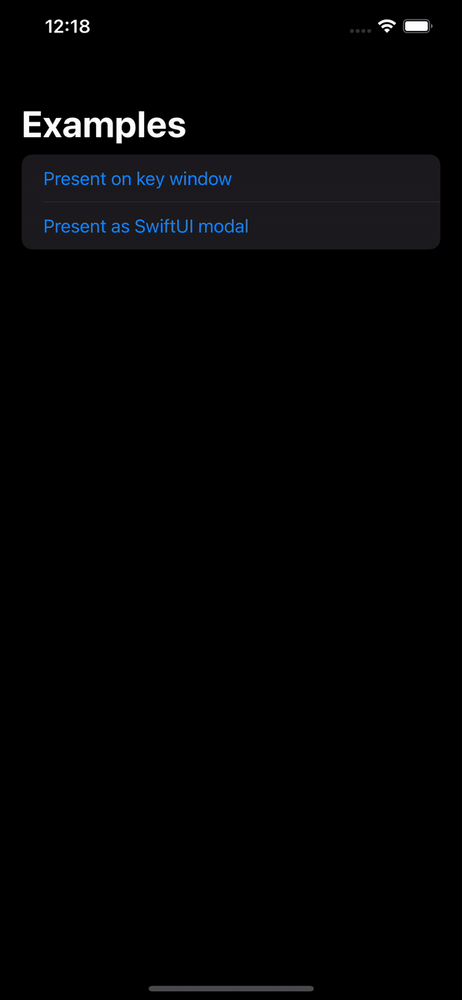
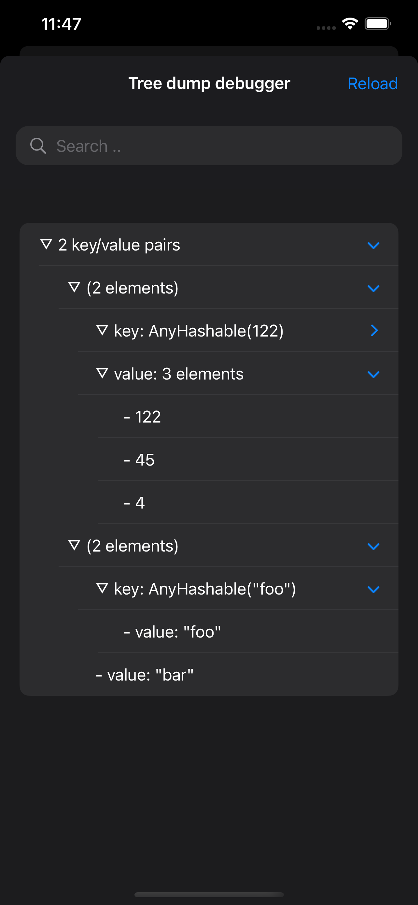
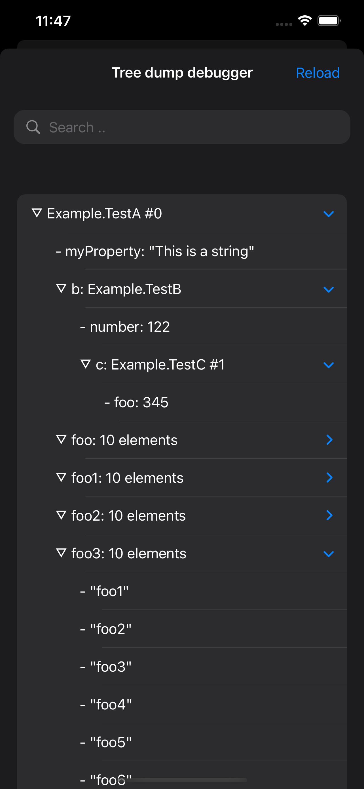
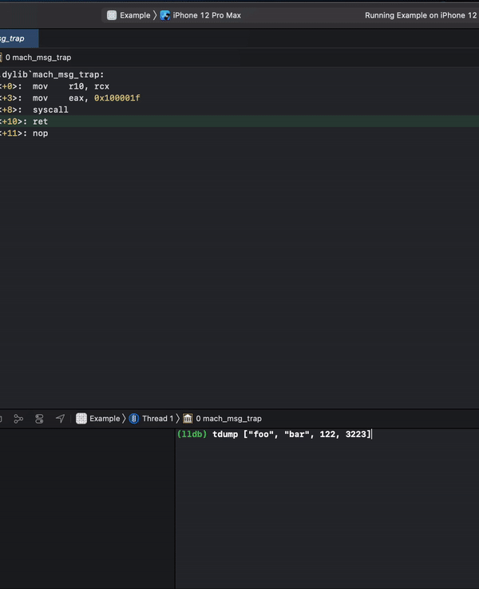

# Tree Dump Debugger
A visual developer tool for inspecting your iOS application data structures.

<p float="left">
 

   
</p>


## Features
Inspect any data structure with only one line of code:

```swift
TreeDumpDebugger.present(["foo": "bar", 122: [122, 45, 4]])
```

Or from a SwiftUI view:

```swift
Button("Press me") {
    showSwiftUIModal = true
}.sheet(isPresented: $showSwiftUIModal) {
    TreeDumpDebugger.makeSwiftUIView(with: ["foo": "bar", 122: [122, 45, 4]])
}
```

You can modify any node in the tree, can be useful if you want different formatting or hide sensitive data:
```swift
struct TestB {
    var number: Int
}
class TestA {
    init(myProperty: String, b: TestB) {
        self.myProperty = myProperty
        self.b = b
    }
    var myProperty: String
    let b: TestB
}

let data = TestA(myProperty: "This is a string", b: TestB(number: 122))

TreeDumpDebugger.present(data) { string in
    if let range = string.range(of: "This is a string") {
        return string.replacingCharacters(in: range, with: "Still a string but changed")
    }
    return string
}

TreeDumpDebugger.present(data) { string in
    return string.replacingOccurrences(of: "▿", with: "😎")
}

```

## How does it work?

Tree Dump Debugger parses indented output into a tree structure. It uses Swift's built `dump` function by default. No private APIs are used.

If you want to use another dumping tool it’s possible to do so by conforming to the `TreeDumpRepresentable` protocol.

```swift
public protocol TreeDumpRepresentable {
    func makeLine(string: String, lineOutput: (String) -> Void)
    func dump(using tree: inout TreeDumpDebugger.Tree)
}
```

So if we for instance would like to use [swift-custom-dump](https://github.com/pointfreeco/swift-custom-dump) which is another great dumping tool:
```swift
import CustomDump

struct CustomDump<T>: TreeDumpRepresentable {
    let value: T
    var name: String? = nil
    var indent: Int = 0
    var maxDepth: Int = .max

    func makeLine(string: String, lineOutput: (String) -> Void) {
        let lines = string.components(separatedBy: .newlines)
        for line in lines {
            lineOutput(line)
        }
    }

    func dump(using tree: inout TreeDumpDebugger.Tree) {
        customDump(value, to: &tree, name: name, indent: indent, maxDepth: maxDepth)
    }

}

TreeDumpDebugger.present(CustomDump(value: data))
```

## Installation

Simply drag and drop `TreeDumpDebugger.swift` into your project. Since this a debugging tool it’s probably a good idea to wrap the whole file in a `#if DEBUG`.

### Why no Swift Package?

There is currently no support to conditionally embed a framework in `Package.swift` for a debug configuration, so a Swift Package would probably just do more harm than good.

## Requirements
iOS 14

## Other ways of using it
The repo also contains a LLDB script that can used to present the debugger view on the fly.
```
(lldb) tdump ["foo", "bar", 122, 3223]
```



To use the script add this line to your `.lldbinit`
```
command script import <path/to/script>
```
Or use [lowmad](https://github.com/bangerang/lowmad)
```bash
$ lowmad install https://github.com/bangerang/tree-dump-debugger.git
```
